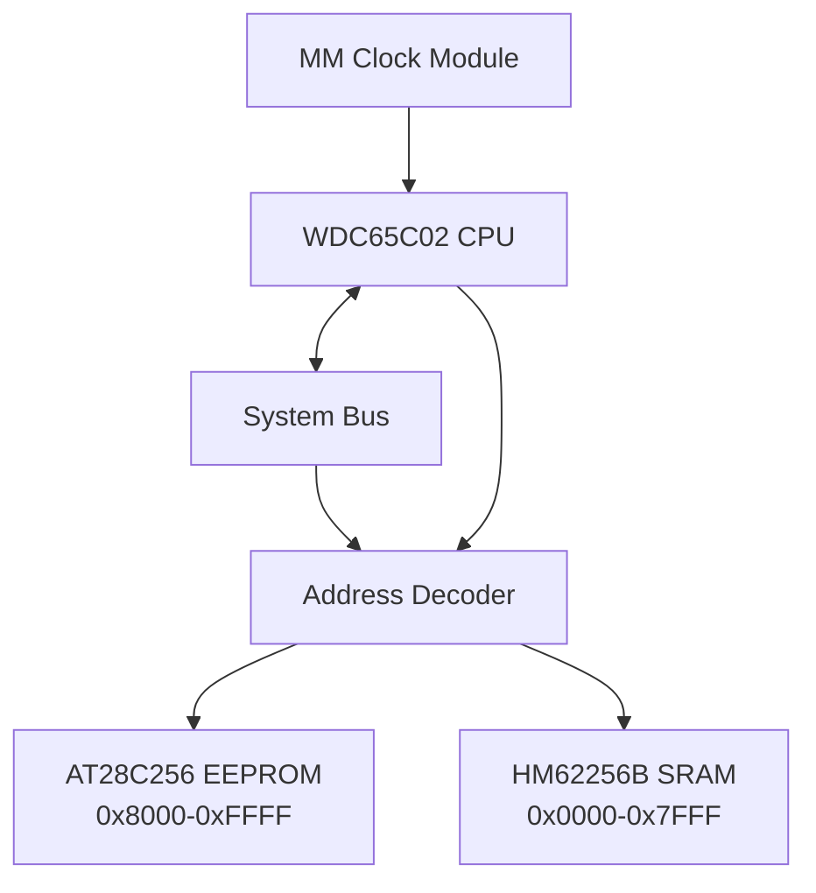
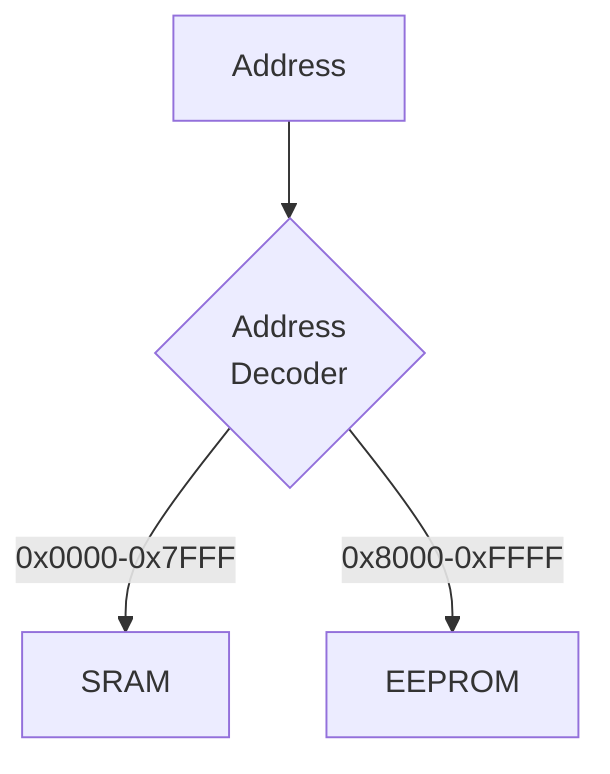
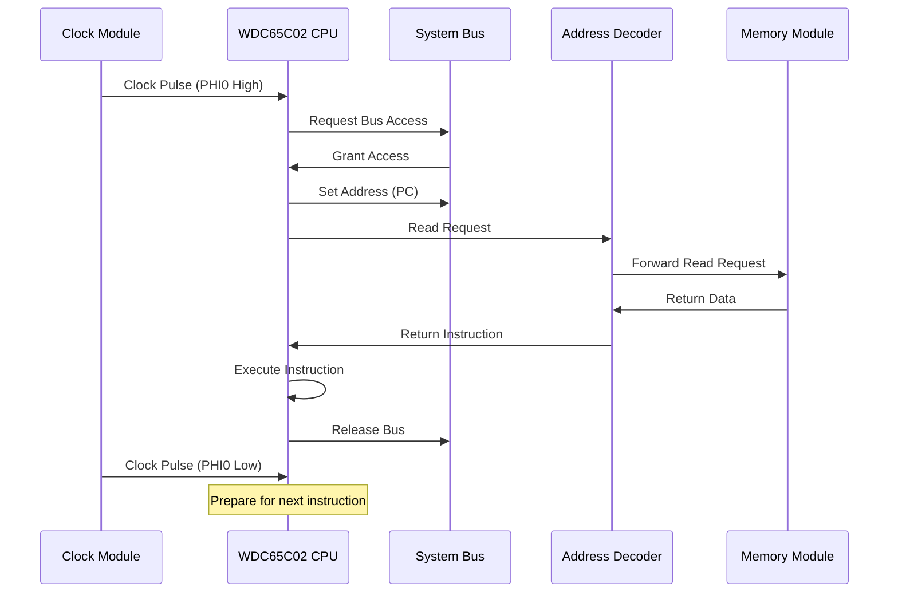
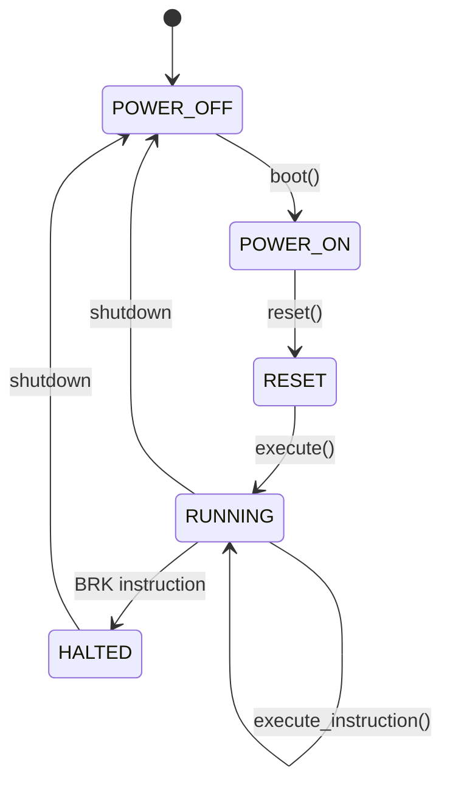

# WDC65C02 Computer Emulator

A comprehensive emulator for a computer system based on the WDC65C02 CPU, featuring accurate component-level emulation with pin-accurate interfaces.

## System Architecture



## Features

- **Pin-Accurate Component Emulation**: Simulates actual hardware behavior at the pin level
- **Complete System**: CPU, RAM, ROM, system bus, address decoder, and clock module
- **Multi-Threaded Design**: Each component runs in its own thread with proper synchronization
- **Configurable Clock Speed**: Adjust execution speed for debugging or performance
- **Detailed Logging**: Monitor system state with color-coded logs
- **Memory Mapping**: Configurable memory layout through the address decoder

## Memory Map

```mermaid
graph LR
    classDef ram;
    classDef rom;
    classDef special;

    R0["0x0000-0x7FFF<br>RAM (32KB)"] -.-> FULL["64KB<br>Address Space"]
    R1["0x8000-0xFFFB<br>ROM (Program)"] -.-> FULL
    R2["0xFFFC-0xFFFD<br>Reset Vector"] -.-> FULL
    R3["0xFFFE-0xFFFF<br>ROM (Reserved)"] -.-> FULL

    class R0 ram
    class R1,R3 rom
    class R2 special
```

## Component Details

### WDC65C02 CPU

Emulates the Western Design Center 65C02 8-bit microprocessor with:

- Full register set (A, X, Y, SP, PC)
- Status register with all flags (N, V, B, D, I, Z, C)
- Core instruction set implementation
- Bus interface for memory access
- Clock synchronization

### Memory System

**RAM: HM62256B SRAM**

- 32KB capacity (0x0000-0x7FFF)
- Pin-accurate interface
- Read/write operations synchronized with bus

**ROM: AT28C256 EEPROM**

- 32KB capacity (0x8000-0xFFFF)
- Pin-accurate interface
- Contains program code and reset vectors

### System Bus

Central communication channel:

```mermaid
graph LR
    classDef address;
    classDef data;
    classDef control;

    A[Address Lines<br>16 bits] --- BUS[System Bus]
    D[Data Lines<br>8 bits] --- BUS
    C[Control Signals] --- BUS

    class A address
    class D data
    class C control
```

Features:

- Mutex-protected access for thread safety
- Component ownership arbitration
- Direct pin-level interface

### Clock Module

Provides timing signals with two operational modes:

- **A_STABLE**: Continuous clock pulses at configurable frequency
- **MONO_STABLE**: Manual stepping for debugging

### Address Decoder

Maps the 16-bit address space to appropriate memory modules:



## CPU Instruction Flow



## Execution State Machine



## Building and Running

### Prerequisites

- C++17 compatible compiler
- CMake 3.10 or higher
- Make (optional)

### Setup and Build

```bash
# Initial setup (only needed once)
make setup

# Build the emulator
make build

# Run the emulator
make run

# Build and run (shorthand)
make
```

### Clock Speed Configuration

Edit the clock speed in `main.cpp` to adjust execution speed:

```cpp
MM_ClockModule clock(2.0f, ClockMode::A_STABLE);  // 2 Hz
```

- **Lower values** (e.g., 0.5 Hz): Slower execution, better for observing execution details
- **Higher values** (e.g., 10 Hz): Faster execution, better for running longer programs

## Test Program

The emulator comes with a simple test program that demonstrates basic CPU operations:

```assembly
LDA #$42    ; Load value 0x42 into A register
LDX #$08    ; Load value 0x08 into X register
LDY #$15    ; Load value 0x15 into Y register
STA $2000   ; Store value in A to memory location 0x2000
INX         ; Increment X register
DEY         ; Decrement Y register
TAX         ; Transfer A to X
TYA         ; Transfer Y to A
NOP         ; No operation
BRK         ; Break (halt CPU)
```

## Creating Custom ROM Images

Use the included Python script to create your own ROM images:

```bash
python scripts/makerom.py
```

This generates a `rom.bin` file that you can load into the emulator.

## Project Structure

```
m65c02-computer/
├── CMakeLists.txt         # CMake build configuration
├── Makefile               # Make shortcuts for common tasks
├── include/               # Header files
│   ├── at28c256.h         # EEPROM implementation
│   ├── bus.h              # System bus
│   ├── colors.h           # Terminal color definitions
│   ├── decoder.h          # Address decoder
│   ├── hm62256b.h         # SRAM implementation
│   ├── log.h              # Logging system
│   ├── memory.h           # Memory interface
│   ├── mm_clock.h         # Clock module
│   ├── op_codes.h         # CPU instruction definitions
│   ├── types.h            # Common type definitions
│   └── wdc65c02.h         # CPU implementation
├── lib/                   # Implementation files
│   ├── at28c256.cpp
│   ├── bus.cpp
│   ├── decoder.cpp
│   ├── hm62256b.cpp
│   ├── mm_clock.cpp
│   └── wdc65c02.cpp
├── scripts/
│   └── makerom.py         # ROM creation utility
└── src/
    └── main.cpp           # Main program
```

## Advanced Usage

### Modifying Memory Map

To change the memory mapping, edit the address decoder setup in `main.cpp`:

```cpp
// Example: Add memory-mapped I/O region
decoder.add_mapping(0x6000, 0x600F, &io_device);
```

### Implementing New Instructions

To add support for new CPU instructions:

1. Add the opcode to `op_codes.h`
2. Implement the instruction in `WDC65C02::execute_instruction()` in `wdc65c02.cpp`

### Adding Peripheral Devices

To add new hardware components:

1. Create a new class implementing the appropriate interfaces
2. Connect it to the bus in `main.cpp`
3. Map any memory-mapped registers through the address decoder

## Future Enhancements

- Additional peripheral devices (VIA, SID, etc.)
- Support for interrupts (IRQ/NMI)
- Complete instruction set implementation
- Visual/graphical interface
- Debugging features (breakpoints, memory inspection)

## License

This project is provided as-is for educational purposes.

## Acknowledgements

This emulator was inspired by various resources on 6502 architecture and emulation techniques.
